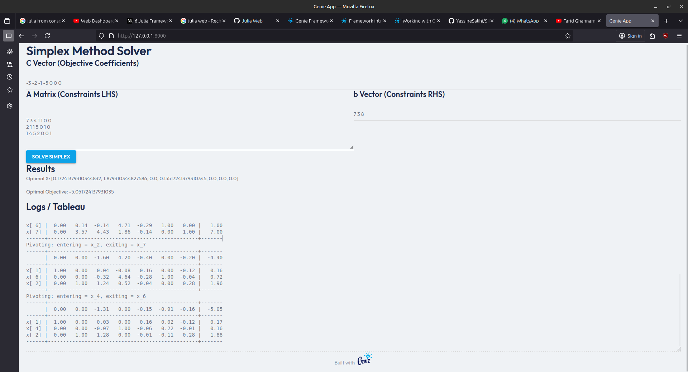

# Simplex Method Solver

A robust implementation of the Simplex Algorithm in Julia, featuring both a command-line interface and a modern web-based graphical user interface (GUI) built with functionalities from the Genie Framework.



## Overview

This project implements the Simplex algorithm for solving Linear Programming (LP) problems. It provides a step-by-step table visualization of the pivoting process, making it an excellent educational tool for understanding optimization.

## Features

-   **Core Algorithm**: Efficient Julia implementation of the Simplex Method.
-   **Web Interface**: Interactive GUI to input variables and view results dynamically.
-   **Step-by-Step Visualization**: Displays initial and intermediate Simplex tableaus.
-   **Dual Modes**: Run as a CLI script or a Web Application.

## Mathematical Formulation

The solver addresses Linear Programming problems in the standard form:

**Minimize:**
$$ Z = c^T x $$

**Subject to:**
$$ Ax = b $$
$$ x \ge 0 $$

Where:
-   $x$ is the vector of variables (to be determined).
-   $c$ and $b$ are vectors of known coefficients.
-   $A$ is a known matrix of coefficients.

## Getting Started

### Prerequisites

-   [Julia](https://julialang.org/downloads/) (v1.6 or later recommended)

### Installation

1.  Clone the repository:
    ```bash
    git clone https://github.com/YassineSalihi/SIMPLEX.git
    cd GUI_SIMPLEXE
    ```
2.  Instantiate the project dependencies:
    ```bash
    julia --project -e 'using Pkg; Pkg.instantiate()'
    ```

### Usage

#### 1. Web Application (Recommended)
Launch the interactive web interface:

```bash
julia run_app.jl
```

Open your browser and navigate to: `http://127.0.0.1:8000`

#### 2. Command Line Interface
Run the solver on a predefined set of data:

```bash
julia run_simlex.jl
```

You can modify the input vectors directly in `run_simlex.jl`.

## References

-   **Base Implementation**: Inspired by coursework and standard Simplex algorithm definitions.
-   **Further Reading**: [Simplex Method for Linear Programming](https://medium.com/@muditbits/simplex-method-for-linear-programming-1f88fc981f50)

---
*Developed for educational purposes.*
